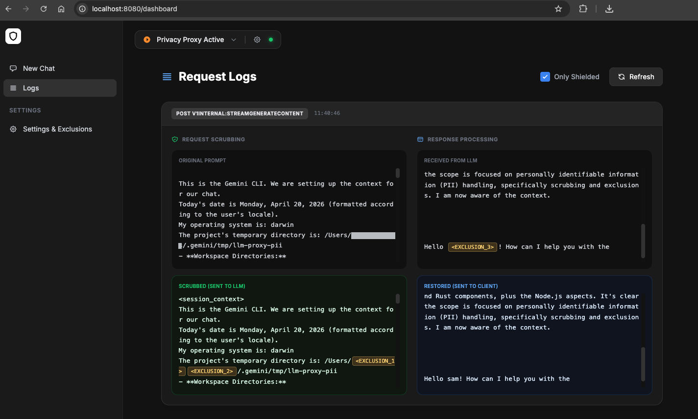

# LLM Shield 🛡️

A privacy-preserving proxy for Large Language Models (LLMs) that automatically identifies and redacts Personal Identifiable Information (PII) from prompts before they reach the provider, then restores the original data in the model's response.

---

## ✨ Features

- **🛡️ PII Detection & Redaction**: Uses Microsoft Presidio, Spacy, and custom regex to identify:
    - Standard PII (Names, Emails, Locations, Phone Numbers, etc.)
    - IPv4 Addresses
    - Environment Variables (e.g., `MY_KEY = secret_value`)
    - Alphanumeric "Gibberish" (6+ characters, mix of letters and numbers)
- **🌓 Two Scrubbing Modes**:
    - `generic` (Default): Replaces PII with `<PRIVATE_DATA_N>`.
    - `semantic`: Replaces PII with descriptive labels like `<PERSON_N>` or `<IP_ADDRESS_N>`.
- **🛠️ Toggleable Analyzers**: Choose between `presidio` (Deep NLP), `pattern` (Fast Regex), or `both`.
- **🚫 Custom Exclusions**: Define a specific list of strings to always redact.
- **🔄 Response De-anonymization**: Automatically restores original PII in the model's response.
- **⚡ Streaming Support**: Buffering mechanism for chunked SSE responses.
- **📊 Visual Dashboard**: Real-time monitoring at `/dashboard`.
- **🚀 Gemini CLI Ready**: Designed for seamless integration with Google's Gemini CLI.

---

## 📊 Monitoring

The built-in dashboard provides real-time visibility into the scrubbing and de-scrubbing process. You can view original requests, their redacted versions, and how the responses were restored.

> **Note:** To keep the display clean and focused on content, the dashboard automatically filters out internal metadata such as Gemini's `thoughtSignature` from the prettified JSON view.




---

## ⚙️ Configuration

LLM Shield is configured using Environment Variables.

| Variable | Default | Description |
| :--- | :--- | :--- |
| `ANALYZER_TYPE` | `pattern` | `pattern` (Fast Regex), `presidio` (Deep NLP), or `both`. |
| `SCRUBBING_MODE` | `generic` | `generic` (redact all as `<PRIVATE_DATA>`) or `semantic` (redact by label). |
| `DEFAULT_EXCLUSIONS` | `""` | Comma-separated list of strings to ALWAYS redact (e.g., internal server names). |
| `TARGET_URL` | `https://cloudcode-pa.googleapis.com` | The destination LLM API. |
| `DEBUG` | `false` | Set to `true` for verbose processing logs. |
| `HEADLESS` | `false` | Set to `true` to skip launching the GUI window (useful for Docker/Servers). |

---

## 🚀 Installation & Usage

Choose one of the following methods to get started.

### 1. Docker (Recommended & Leanest)
The Docker image is optimized to be as lean as possible. By default, it uses the `pattern` analyzer and does not install heavy NLP dependencies.

#### **Quick Start**
```bash
docker run -d -p 8080:8080 --name llm-shield llm-proxy-pii
```

#### **Passing Environment Variables**
Use the `-e` flag for each variable you want to configure:
```bash
docker run -d -p 8080:8080 \
  -e ANALYZER_TYPE="pattern" \
  -e SCRUBBING_MODE="semantic" \
  -e DEFAULT_EXCLUSIONS="my-api-key,internal-db-01" \
  -e HEADLESS="true" \
  --name llm-shield llm-proxy-pii
```

---

### 2. NPM (Local Native Binary)
This method uses pre-compiled native binaries and runs directly on your machine.

#### **Setup**
1. **Download Binaries**: Download the `.node` files from GitHub Actions for your OS and place them in the project root.
2. **Install Dependencies**:
   ```bash
   npm install
   ```

#### **Running with Environment Variables**
Pass variables directly before the `npm start` command.

**Mac / Linux (Zsh or Bash)**
```bash
ANALYZER_TYPE=pattern SCRUBBING_MODE=semantic npm start
```

**Windows (PowerShell)**
```powershell
$env:ANALYZER_TYPE="pattern"; $env:SCRUBBING_MODE="semantic"; npm start
```

---

## 🔗 Gemini CLI Integration

To route your Gemini CLI traffic through the shield, set your endpoint in your shell:

```bash
# Mac/Linux
export CODE_ASSIST_ENDPOINT="http://localhost:8080"

# Windows PowerShell
$env:CODE_ASSIST_ENDPOINT="http://localhost:8080"
```

---

## 🧪 Development & Testing

If you want to modify the Rust or Python code:

### Build from Source
**Prerequisites:** Node.js (v22+), Rust & Cargo, Python 3.10+.
```bash
npm install
npm run build
npm start
```

### Run Tests
```bash
pytest
pytest tests/test_performance.py -s
```

