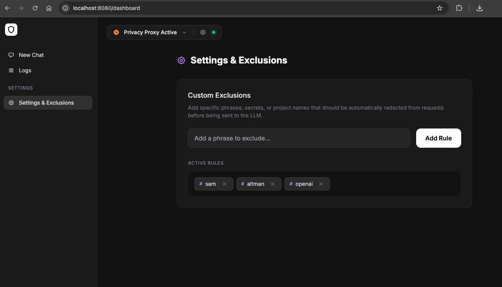

# LLM Shield 🛡️

A privacy-preserving proxy for Large Language Models (LLMs) that automatically identifies and redacts Personal Identifiable Information (PII) from prompts before they reach the provider, then restores the original data in the model's response.

---

## ✨ Features

- **🛡️ PII Detection & Redaction**: Uses Microsoft Presidio, Spacy, and custom regex to identify:
    - Standard PII (Names, Emails, Locations, Phone Numbers, etc.)
    - IPv4 Addresses
    - Environment Variables (e.g., `MY_KEY = secret_value`)
    - Alphanumeric "Gibberish" (6+ characters, mix of letters and numbers)
- **🌓 Two Scrubbing Modes**:
    - `generic` (Default): Replaces PII with `<PRIVATE_DATA_N>`.
    - `semantic`: Replaces PII with descriptive labels like `<PERSON_N>` or `<IP_ADDRESS_N>`.
- **🛠️ Toggleable Analyzers**: Choose between `presidio` (Deep NLP), `pattern` (Fast Regex), or `both`.
- **🚫 Custom Exclusions**: Define a specific list of strings to always redact.
- **🔄 Response De-anonymization**: Automatically restores original PII in the model's response.
- **⚡ Streaming Support**: Buffering mechanism for chunked SSE responses.
- **📊 Visual Dashboard**: Real-time monitoring at `/dashboard`.
- **🚀 Gemini CLI Ready**: Designed for seamless integration with Google's Gemini CLI.

---

## 📊 Monitoring

The built-in dashboard provides real-time visibility into the scrubbing and de-scrubbing process. You can view original requests, their redacted versions, and how the responses were restored.

> **Note:** To keep the display clean and focused on content, the dashboard automatically filters out internal metadata such as Gemini's `thoughtSignature` and `inlineData` from the prettified JSON view.





---

## ⚙️ Configuration

LLM Shield is configured using Environment Variables.

| Variable | Default | Description |
| :--- | :--- | :--- |
| `ANALYZER_TYPE` | `pattern` | `pattern` (Fast Regex), `presidio` (Deep NLP), or `both`. |
| `SCRUBBING_MODE` | `generic` | `generic` (redact all as `<PRIVATE_DATA>`) or `semantic` (redact by label). |
| `DEFAULT_EXCLUSIONS` | `""` | Comma-separated list of strings to ALWAYS redact (e.g., internal server names). |
| `TARGET_URL` | `https://cloudcode-pa.googleapis.com` | The destination LLM API. |
| `HOST` | `127.0.0.1` | Interface for the local proxy to bind. Use `0.0.0.0` only when the service must be reachable from outside the machine/container. |
| `PORT` | `8080` | Local proxy port. |
| `DASHBOARD_TOKEN` | `""` | Optional bearer token required for `/dashboard` and internal `/api/*` routes when set. A warning is printed when binding to all interfaces without it. |
| `DEBUG` | `false` | Set to `true` for verbose processing logs. |
| `HEADLESS` | `false` | Set to `true` to skip launching the GUI window (useful for Docker/Servers). |

---

## 🚀 Installation

Choose the method that best fits your workflow.

### 1. Standalone Native App (Easiest)
Download a single executable that includes everything you need. No Python, Node, or Rust installation required.

1.  **Download**: Go to the [Releases](https://github.com/Ddyedidya/llm-shield/releases) page and download the binary for your OS:
    *   `LLMShield-windows.exe` (Windows)
    *   `LLMShield-macos-silicon` (Apple Silicon M1/M2/M3)
    *   `LLMShield-macos-intel` (Intel Mac)
    *   `LLMShield-linux` (Linux)
2.  **Permissions (Mac/Linux only)**: Open your terminal and grant execution permission:
    ```bash
    chmod +x LLMShield-macos-silicon
    ```
3.  **Run**: Double-click the file (Windows) or run from terminal:
    ```bash
    ./LLMShield-macos-silicon
    ```

### 2. Docker (Recommended for Servers)
The most portable way to run the shield, especially in headless or cloud environments.

```bash
docker run -d -p 8080:8080 --name llm-shield llm-proxy-pii
```

---

## ⚙️ Usage & Configuration

Regardless of how you installed the shield, you can configure its behavior using Environment Variables.

### Common Configuration Options
| Variable | Default | Description |
| :--- | :--- | :--- |
| `DEFAULT_EXCLUSIONS` | `""` | Comma-separated list of strings to ALWAYS redact. |
| `ANALYZER_TYPE` | `pattern` | `pattern` (Fast Regex), `presidio` (Deep NLP), or `both`. |
| `SCRUBBING_MODE` | `generic` | `generic` (redact as `<PRIVATE_DATA>`) or `semantic` (redact by label). |
| `HOST` | `127.0.0.1` | Interface for the local proxy to bind. Docker sets this to `0.0.0.0`. |
| `PORT` | `8080` | Local proxy port. |
| `HEADLESS` | `false` | Set to `true` to skip launching the GUI window. |

### Running with Variables

When `DASHBOARD_TOKEN` is set, pass `Authorization: Bearer <token>` for API access or open `/dashboard?token=<token>` once in the browser to set the dashboard cookie.

**Mac / Linux (Zsh or Bash)**
```bash
DEFAULT_EXCLUSIONS="my-project-name,internal-ip" ANALYZER_TYPE=both ./LLMShield-macos-silicon
```

**Windows (PowerShell)**
```powershell
$env:DEFAULT_EXCLUSIONS="my-project-name"; $env:ANALYZER_TYPE="both"; .\LLMShield-windows.exe
```

**Docker**
```bash
docker run -d -p 8080:8080 -e DEFAULT_EXCLUSIONS="secret-val" llm-proxy-pii
```

---

## 🔗 Gemini CLI Integration

To route your Gemini CLI traffic through the shield, set your endpoint in your shell:

```bash
# Mac/Linux
export CODE_ASSIST_ENDPOINT="http://localhost:8080"

# Windows PowerShell
$env:CODE_ASSIST_ENDPOINT="http://localhost:8080"
```

## 🔗 Codex CLI Integration

To route Codex CLI traffic through the shield, set the OpenAI base URL in `~/.codex/config.toml`:

```toml
openai_base_url = "http://localhost:8080/v1"
```

Run the shield with OpenAI as the target provider:

```bash
docker build -t llm-proxy-pii .
docker rm -f llm-proxy-pii-container 2>/dev/null
docker run -d \
  -p 127.0.0.1:8080:8080 \
  -e HEADLESS=true \
  -e TARGET_URL="https://api.openai.com" \
  -e DEFAULT_EXCLUSIONS="your-name,your-project" \
  --name llm-proxy-pii-container \
  llm-proxy-pii
```

If you use API-key auth, keep your normal OpenAI key available:

```bash
export OPENAI_API_KEY="sk-..."
codex
```

---

## 🧪 Development & Testing

If you want to modify the Python proxy:

### Run Locally
**Prerequisites:** Python 3.10+.
```bash
python -m pip install -r requirements.txt
HEADLESS=true python src/proxy.py
```

### Build Docker Image
```bash
docker build -t llm-proxy-pii .
```

### Run Tests
```bash
pytest
pytest tests/test_performance.py -s
```


## TODO

- [ ] Explore lightweight PII detection alternatives to replace Presidio (e.g., **Scrubadub** or **DataFog**).
